# Database Schema Diagram

## Entity Relationship Diagram (ERD)

```mermaid
erDiagram
    USERS {
        bigint id PK
        string name
        string email UK
        timestamp email_verified_at
        string password
        bigint role_id FK
        timestamp created_at
        timestamp updated_at
    }

    ROLES {
        bigint id PK
        string name
        string description
        timestamp created_at
        timestamp updated_at
    }

    CUSTOMERS {
        bigint id PK
        string name
        string email
        string phone
        text address
        timestamp created_at
        timestamp updated_at
    }

    SUPPLIERS {
        bigint id PK
        string name
        string contact_info
        string email
        string phone
        string payment_terms
        decimal credit_limit
        text address
        timestamp created_at
        timestamp updated_at
    }

    CATEGORIES {
        bigint id PK
        string name
        text description
        timestamp created_at
        timestamp updated_at
    }

    WAREHOUSES {
        bigint id PK
        string name
        string location
        text description
        timestamp created_at
        timestamp updated_at
    }

    PRODUCTS {
        bigint id PK
        string name
        string sku UK
        bigint category_id FK
        string brand
        decimal unit_price
        decimal cost_price
        integer quantity_available
        bigint warehouse_id FK
        string barcode
        date expiry_date
        timestamp created_at
        timestamp updated_at
    }

    PRODUCT_VARIANTS {
        bigint id PK
        bigint product_id FK
        string variant_name
        string variant_value
        decimal price_adjustment
        timestamp created_at
        timestamp updated_at
    }

    SUPPLIER_PRODUCTS {
        bigint id PK
        bigint supplier_id FK
        bigint product_id FK
        timestamp created_at
        timestamp updated_at
    }

    ORDERS {
        bigint id PK
        enum type
        bigint user_id FK
        bigint supplier_id FK
        string customer_info
        date order_date
        decimal total_amount
        timestamp created_at
        timestamp updated_at
    }

    ORDER_ITEMS {
        bigint id PK
        bigint order_id FK
        bigint product_id FK
        integer quantity
        decimal price
        timestamp created_at
        timestamp updated_at
    }

    PURCHASES {
        bigint id PK
        bigint supplier_id FK
        bigint user_id FK
        string reference
        decimal total_amount
        enum status
        date purchase_date
        timestamp created_at
        timestamp updated_at
    }

    PURCHASE_ITEMS {
        bigint id PK
        bigint purchase_id FK
        bigint product_id FK
        integer quantity
        decimal cost_price
        decimal subtotal
        timestamp created_at
        timestamp updated_at
    }

    SALES {
        bigint id PK
        bigint customer_id FK
        bigint user_id FK
        string reference
        decimal total_amount
        enum status
        date sale_date
        text customer_info
        timestamp created_at
        timestamp updated_at
    }

    SALE_ITEMS {
        bigint id PK
        bigint sale_id FK
        bigint product_id FK
        integer quantity
        decimal selling_price
        decimal subtotal
        timestamp created_at
        timestamp updated_at
    }

    STOCK_MOVEMENTS {
        bigint id PK
        bigint product_id FK
        bigint user_id FK
        enum type
        integer quantity
        decimal cost_price
        decimal selling_price
        bigint warehouse_id FK
        date movement_date
        text note
        timestamp created_at
        timestamp updated_at
    }

    EXPENSES {
        bigint id PK
        string title
        decimal amount
        bigint user_id FK
        date expense_date
        text note
        timestamp created_at
        timestamp updated_at
    }

    AUDIT_LOGS {
        bigint id PK
        bigint user_id FK
        string action
        string model_type
        bigint model_id
        json old_values
        json new_values
        timestamp created_at
        timestamp updated_at
    }

    %% Relationships
    USERS ||--o{ ROLES : "belongs to"
    USERS ||--o{ ORDERS : "creates"
    USERS ||--o{ PURCHASES : "creates"
    USERS ||--o{ SALES : "creates"
    USERS ||--o{ STOCK_MOVEMENTS : "performs"
    USERS ||--o{ EXPENSES : "creates"
    USERS ||--o{ AUDIT_LOGS : "performs"

    CUSTOMERS ||--o{ SALES : "makes purchases"

    SUPPLIERS ||--o{ PURCHASES : "supplies"
    SUPPLIERS ||--o{ ORDERS : "receives"
    SUPPLIERS ||--o{ SUPPLIER_PRODUCTS : "supplies"

    CATEGORIES ||--o{ PRODUCTS : "categorizes"

    WAREHOUSES ||--o{ PRODUCTS : "stores"
    WAREHOUSES ||--o{ STOCK_MOVEMENTS : "tracks"

    PRODUCTS ||--o{ PRODUCT_VARIANTS : "has variants"
    PRODUCTS ||--o{ SUPPLIER_PRODUCTS : "supplied by"
    PRODUCTS ||--o{ ORDER_ITEMS : "ordered in"
    PRODUCTS ||--o{ PURCHASE_ITEMS : "purchased in"
    PRODUCTS ||--o{ SALE_ITEMS : "sold in"
    PRODUCTS ||--o{ STOCK_MOVEMENTS : "moved"

    ORDERS ||--o{ ORDER_ITEMS : "contains"

    PURCHASES ||--o{ PURCHASE_ITEMS : "contains"

    SALES ||--o{ SALE_ITEMS : "contains"
```

## Table Descriptions

### Core Business Tables

1. **USERS** - System users (staff, admins)
2. **ROLES** - User roles and permissions
3. **CUSTOMERS** - Customer information
4. **SUPPLIERS** - Supplier information

### Product Management

5. **CATEGORIES** - Product categories
6. **PRODUCTS** - Product catalog with pricing and inventory
7. **PRODUCT_VARIANTS** - Product variations (size, color, etc.)
8. **WAREHOUSES** - Storage locations
9. **SUPPLIER_PRODUCTS** - Many-to-many relationship between suppliers and products

### Transaction Tables

10. **ORDERS** - Purchase/sales orders
11. **ORDER_ITEMS** - Items within orders
12. **PURCHASES** - Purchase transactions
13. **PURCHASE_ITEMS** - Items within purchases
14. **SALES** - Sales transactions
15. **SALE_ITEMS** - Items within sales

### Inventory & Tracking

16. **STOCK_MOVEMENTS** - Inventory movements (in/out)
17. **EXPENSES** - Business expenses
18. **AUDIT_LOGS** - System activity tracking

## Key Relationships

- **Users** can have multiple roles and perform various actions
- **Products** belong to categories and can be stored in warehouses
- **Suppliers** can supply multiple products (many-to-many)
- **Orders** can be either purchases or sales with associated items
- **Stock movements** track inventory changes across warehouses
- **All transactions** are linked to users for audit purposes

## Indexes and Performance

The database includes indexes on:
- Foreign key columns for join performance
- Frequently queried columns (SKU, barcode, dates)
- Search columns (email, phone, reference numbers)
- Status and type columns for filtering

## Data Integrity

- Foreign key constraints ensure referential integrity
- Cascade deletes for dependent records
- Null constraints where appropriate
- Unique constraints on SKU and email fields
